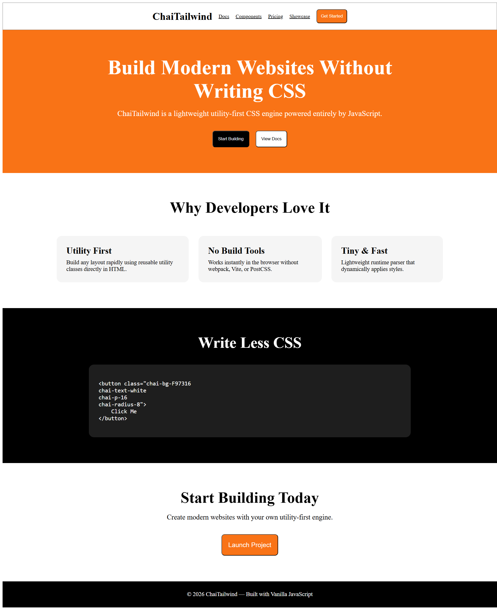

# ChaiTailwind

A lightweight utility-first CSS engine built with JavaScript.

## How it works

ChaiTailwind scans the DOM for classes starting with `chai-`, parses them into CSS properties and values, applies the styles inline, and removes the original classes.

## Supported Utilities

- Spacing: `chai-p-{n}` (padding: {n}px), `chai-m-{n}` (margin: {n}px)
- Colors: `chai-bg-{color}` (background-color: {color}), `chai-text-{color}` (color: {color})
- Typography: `chai-text-{align}` (text-align: {align}), `chai-fs-{n}` (font-size: {n}px)
- Borders: `chai-border` (border: 1px solid black), `chai-border-{n}` (border-width: {n}px), `chai-radius-{n}` (border-radius: {n}px)
- Layout: `chai-flex` (display: flex), `chai-block` (display: block), `chai-inline` (display: inline)
- Dimensions: `chai-w-{n}` (width: {n}px), `chai-h-{n}` (height: {n}px)

## Usage

Include `chai.js` in your HTML:

```html
<script src="chai.js"></script>
```

Use classes like:

```html
<div class="chai-bg-red chai-p-10 chai-text-center">Hello</div>
```

## Demo

Open `index.html` in a browser to see the demo.

## Screenshot


